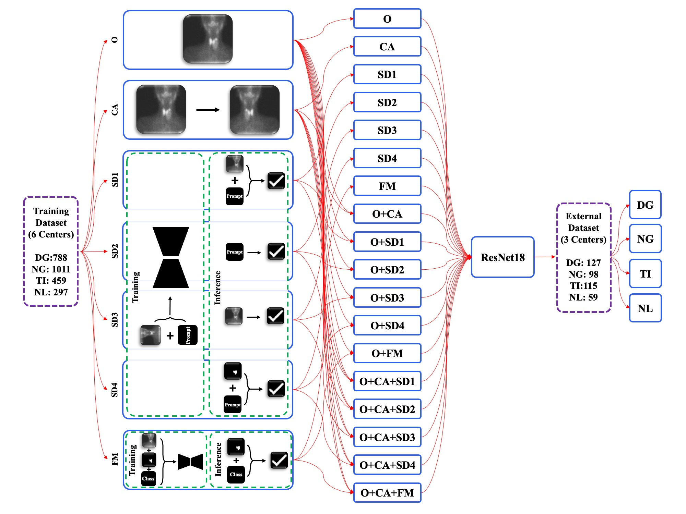
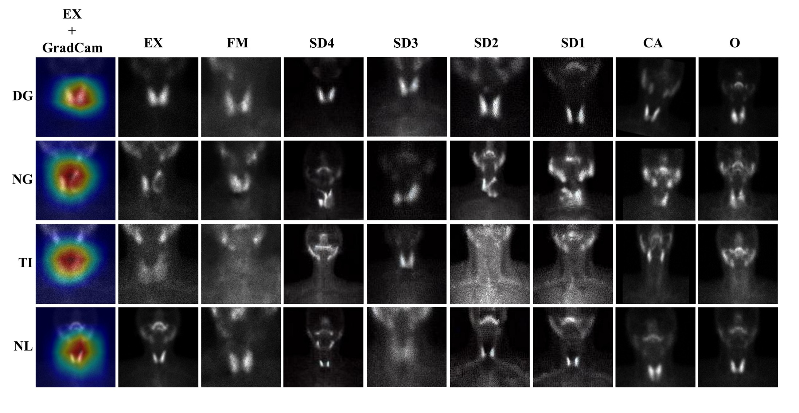

# Diffusion-Based-Scintigraphy-Augmentation

This repository contains the training and inference scripts used to fine-tune Stable Diffusion and generate synthetic thyroid scintigraphy images. This code supports the data augmentation pipeline presented in our published paper.

## 🌊 Flow Matching vs. Stable Diffusion
In our study, we explored two distinct generative pipelines for thyroid scintigraphy augmentation:
1. **Stable Diffusion Pipeline**: Fully detailed, optimized, and provided in this repository. 
2. **Masked Optimal Transport Flow Matching (MOTFM) Pipeline**: For details and code regarding the Flow Matching methodology, please refer to our related [Paper (Springer)](https://link.springer.com/chapter/10.1007/978-3-032-05325-1_21) and [GitHub Repository (milad1378yz/MOTFM)](https://github.com/milad1378yz/MOTFM).

## 📊 Study Overview & Results


*Overview of the study workflow illustrating the dataset, augmentation strategies, and model training. (DG: Diffuse Goiter, NG: Nodular Goiter, NL: Normal, TI: Thyroiditis, O: Original, CA: Conventional Augmentation, SD: Stable Diffusion, FM: Flow Matching)*


*Examples of original and augmented images for each class using different methods. Grad-CAM visualizations from the O+FM model are also shown on external dataset samples, highlighting the model’s focus during prediction. (DG: Diffuse Goiter, NG: Nodular Goiter, NL: Normal, TI: Thyroiditis, O: Original, CA: Conventional Augmentation, SD: Stable Diffusion, FM: Flow Matching, EX: External)*

---

This repository includes a highly-optimized text-to-image finetuning pipeline and a unified, high-performance inference script (`Inference_combined.py`) that utilizes CUDA streams for parallel processing and includes automatic handling of generated black images (safety checker retries).

## 🚀 Features

- **Fine-Tuning Script**: Ready-to-go `accelerate` training shell script to adapt pre-trained Stable Diffusion v1.4 to medical images.
- **Four Generation Modes**: image-to-image, text-guided image-to-image, mask-guided generation, and pure text-to-image.
- **Optimized for Speed**: Utilizes FP16 precision, gradient accumulation, and CUDA streams for efficient batch processing.
- **Robust Generation**: Automatically detects collapsed/black output images and regenerates them up to a specified retry limit.
- **Dataset Integration**: Seamlessly reads from an Excel dataset registry containing metadata, class labels, and text prompts.

## 🛠️ Prerequisites & Installation

Ensure you have a CUDA-capable GPU and the necessary drivers installed. Use python 3.8+ and install the dependencies:

```bash
pip install -r requirements.txt
```

*Note: The key libraries used include `accelerate`, `torch`, `diffusers`, `transformers`, `pandas`, and `Pillow`.*

## 📂 Data Preparation

Before running the training or inference scripts, ensure your directories and files are set up properly.
Using the latest configurations, your workspace should look something like this:

- **Metadata Excel File**: `../Data/Scintigraphy.xlsx` containing `ID` (image ID), `Prompt` (text condition), and `Class` (target class).
- **Image Directory**: `../IMAGES` containing your source `.jpg` images, named exactly as their `ID`.
- **Mask Directory**: `../MASKS` containing label maps as `.jpg` images used for spatial conditioning, similarly named by `ID`.

Your basic folder structure should look like this:
```text
├── Data/
│   └── Scintigraphy.xlsx
├── IMAGES/
│   ├── image_001.jpg
│   ├── image_002.jpg
│   ├── ...
│   └── metadata.jsonl      <-- Required for training
└── MASKS/
    ├── image_001.jpg
    ├── image_002.jpg
    └── ...
```

### Creating the HuggingFace `metadata.jsonl` (for Training)
The `train_text_to_image.py` script relies on HuggingFace `datasets`. For the script to pair your images with the correct training prompts, you must create a `metadata.jsonl` file and **place it directly inside your `../IMAGES/` directory**.

The `metadata.jsonl` file should look like this (one JSON object per line):
```jsonl
{"file_name": "image_001.jpg", "text": "A scintigraphy image showing diffuse toxic goiter..."}
{"file_name": "image_002.jpg", "text": "A scintigraphy image showing solitary toxic nodule..."}
```

## 🏋️‍♂️ Training (Fine-Tuning)

To adapt the base Stable Diffusion model to the scintigraphy domain, we use the `train_text_to_image.py` script backed by `accelerate`.

We provide a shell script (`Train.sh`) pre-configured with the optimal hyperparameters used in our paper (e.g., fp16, EMA, center cropping, learning rate of `1e-05`).

1. Open `Train.sh` and make sure the `TRAIN_DIR` matches your dataset image directly.
2. Execute the bash script:

```bash
bash Train.sh
```

**Key Training Hyperparameters inside `Train.sh`:**
- `pretrained_model_name_or_path`: `"CompVis/stable-diffusion-v1-4"`
- `resolution`: `128`
- `train_batch_size`: `1` (with `gradient_accumulation_steps=4`)
- `output_dir`: `../Stable diffusion/Output`

---

## 💻 Inference / Generation

We provide a single entry-point script for inference. You must specify the `--mode` argument corresponding to the augmentation strategy you wish to employ:

```bash
python Inference_combined.py --mode <GENERATION_MODE>
```

*(By default, this script loads the saved checkpoint from `../Stable Diffusion/Output/checkpoint-15000`. You can update this path under `model_path` in `Inference_combined.py` if needed)*

### Supported Modes:

#### 1. Image to Image (`--mode image2image`)
Generates variations of the source image without relying on textual prompts (empty prompt). Ideal for producing pure variations tied intimately to the input distribution.
* **Pipeline**: `AutoPipelineForImage2Image`
* **Input**: Source images from `../IMAGES` + empty prompt
* **Output**: `../01-Image2Image/<class_id>/`

#### 2. Image & Prompt to Image (`--mode image_text2image`)
Guides the variation of the source image using specific text prompts detailing the condition or structure.
* **Pipeline**: `AutoPipelineForImage2Image`
* **Input**: Source images from `../IMAGES` + Text Prompts
* **Output**: `../02-image_text2image/<class_id>/`

#### 3. Mask & Prompt to Image (`--mode mask_text2image`)
Uses segmentation masks (labels) instead of raw RGB images as the spatial basis. The structure of the mask guides the layout, while the text prompt dictates the semantic rendering of the scintigraphy.
* **Pipeline**: `AutoPipelineForImage2Image`
* **Input**: Label Masks from `../MASKS` + Text Prompts
* **Output**: `../03-mask_text2image/<class_id>/`

#### 4. Text to Image (`--mode text2image`)
Pure generative mode starting from standard latent noise, fully directed by the text prompts mapping domain knowledge into visual outputs.
* **Pipeline**: `StableDiffusionPipeline`
* **Input**: Text Prompts only
* **Output**: `../04-Text2Image/<class_id>/`

## 📊 Outputs

Depending on the mode used, the output images are distributed into target-specific folders (e.g., `0/`, `1/`, etc.) located within their respective main directories (`../01-Image2Image/`, etc.). 

The code also exports a sampling Excel file (`<ClassID>.xlsx`) into the target directory to record the exact metadata of the sampled instances.

## 📝 Citation

If you use this code in your research, please consider citing our published work (placeholder):

```bibtex
@article{sabouri2025aiaugmentedthyroidscintigraphyrobust,
  title={AI-Augmented Thyroid Scintigraphy for Robust Classification}, 
  author={Sabouri, Maziar and Hajianfar, Ghasem and Rafiei Sardouei, Alireza and Yazdani, Milad and Asadzadeh, Azin and Bagheri, Soroush and Arabi, Mohsen and Zakavi, Seyed Rasoul and Askari, Emran and Aghaee, Atena and Wiseman, Sam and Shahriari, Dena and Zaidi, Habib and Rahmim, Arman},
  journal={arXiv preprint arXiv:2503.00366},
  year={2025},
  url={https://arxiv.org/abs/2503.00366},
  note={Submitted to [Journal Name / Under Review]}
}
```

## 📄 License
This project is released under the [Apache License 2.0](LICENSE) / appropriate academic license.
